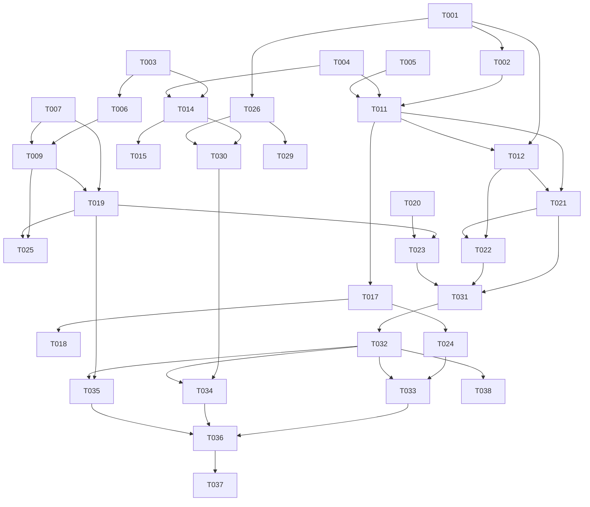

# Implementation Tasks: falloutall.com Personal Website

**Branch**: `001-personal-website` | **Date**: 2025-01-27 | **Plan**: [plan.md](./plan.md) | **Spec**: [spec.md](./spec.md)

## Task Overview

This document contains all implementation tasks for the falloutall.com personal website, organized by priority and dependency order. Tasks are derived from the feature specification and implementation plan.

**Total Tasks**: 47 | **Estimated Effort**: 3-4 weeks | **Critical Path**: Content → Design → Performance → SEO

## Priority 1: Critical Content & Authenticity (Week 1)

### T001: Remove Fake Content
**Priority**: P1 | **Effort**: 2h | **Dependencies**: None
- Remove all fake blog posts from `src/components/sections/Insights.tsx`
- Remove fabricated metrics (views, likes, shares)
- Remove fake publication dates and engagement numbers
- Replace with placeholder for authentic content structure
- **Acceptance**: No fake content remains in codebase

### T002: Rewrite Project Case Studies
**Priority**: P1 | **Effort**: 8h | **Dependencies**: T001
- Update `src/lib/constants.ts` with detailed project descriptions
- Add specific technologies used for each project
- Include quantified metrics and business impact
- Add anonymized client context where appropriate
- **Acceptance**: All projects have specific technical details and quantified achievements

### T003: Enhance Hero Section Content
**Priority**: P1 | **Effort**: 3h | **Dependencies**: None
- Rewrite headline to be more specific and differentiated
- Update subheadline with concrete achievements
- Improve credential line positioning
- **Acceptance**: Hero section clearly communicates unique value proposition

### T004: Update About Section Content
**Priority**: P1 | **Effort**: 4h | **Dependencies**: None
- Rewrite about description with specific achievements
- Update highlights with quantified results
- Improve quote to be more memorable and specific
- **Acceptance**: About section showcases concrete professional achievements

### T005: Enhance Skills Section
**Priority**: P1 | **Effort**: 3h | **Dependencies**: None
- Organize skills by proficiency level or recent experience
- Add specific technologies from CV
- Include relevant certifications and training
- **Acceptance**: Skills section demonstrates depth of technical expertise

## Priority 2: Design Simplification & Readability (Week 1-2)

### T006: Simplify Hero Animations
**Priority**: P1 | **Effort**: 4h | **Dependencies**: T003
- Reduce animation complexity in hero section
- Focus on subtle, professional effects
- Ensure animations don't distract from content
- **Acceptance**: Hero animations enhance rather than distract from messaging

### T007: Optimize Typography Hierarchy
**Priority**: P1 | **Effort**: 3h | **Dependencies**: None
- Improve font sizing and spacing for readability
- Ensure proper contrast ratios
- Optimize for mobile readability
- **Acceptance**: All text is easily readable across devices

### T008: Simplify Card Animations
**Priority**: P2 | **Effort**: 3h | **Dependencies**: T002, T004
- Reduce hover effects and transitions
- Focus on subtle, professional interactions
- Ensure animations don't interfere with content scanning
- **Acceptance**: Card interactions feel professional and don't distract

### T009: Improve Mobile Responsiveness
**Priority**: P1 | **Effort**: 6h | **Dependencies**: T006, T007
- Test and fix mobile layout issues
- Optimize touch targets for mobile
- Ensure content is scannable on small screens
- **Acceptance**: Website works perfectly on mobile devices

### T010: Enhance Navigation UX
**Priority**: P2 | **Effort**: 3h | **Dependencies**: None
- Improve sticky navigation behavior
- Add smooth scrolling between sections
- Optimize mobile navigation menu
- **Acceptance**: Navigation is intuitive and responsive

## Priority 3: Technical Implementation (Week 2)

### T011: Implement Static Data Structure
**Priority**: P1 | **Effort**: 4h | **Dependencies**: T002, T004, T005
- Create JSON files for all static content
- Implement data loading utilities
- Add TypeScript types for all data structures
- **Acceptance**: All content is properly structured and typed

### T012: Add Markdown Content Support
**Priority**: P2 | **Effort**: 4h | **Dependencies**: T001
- Implement markdown processing for insights
- Add frontmatter parsing
- Create content loading utilities
- **Acceptance**: Blog content can be managed via markdown files

### T013: Implement Dark Mode
**Priority**: P2 | **Effort**: 3h | **Dependencies**: None
- Add theme toggle functionality
- Implement theme persistence
- Ensure proper contrast in both modes
- **Acceptance**: Dark mode works seamlessly across all components

### T014: Add SEO Metadata
**Priority**: P1 | **Effort**: 4h | **Dependencies**: T003, T004
- Implement dynamic meta tags
- Add OpenGraph tags
- Create JSON-LD structured data
- **Acceptance**: Website has proper SEO metadata

### T015: Generate Sitemap and Robots.txt
**Priority**: P2 | **Effort**: 2h | **Dependencies**: T014
- Create dynamic sitemap generation
- Add robots.txt file
- Ensure proper indexing
- **Acceptance**: Search engines can properly crawl the site

## Priority 4: Performance & Accessibility (Week 2-3)

### T016: Optimize Images and Assets
**Priority**: P1 | **Effort**: 3h | **Dependencies**: None
- Implement Next.js Image optimization
- Add proper alt text for all images
- Optimize asset loading
- **Acceptance**: All images load quickly and are accessible

### T017: Implement Code Splitting
**Priority**: P1 | **Effort**: 3h | **Dependencies**: T011, T012
- Add dynamic imports for heavy components
- Implement lazy loading for non-critical content
- Optimize bundle size
- **Acceptance**: Initial page load is under 1 second

### T018: Add Performance Monitoring
**Priority**: P2 | **Effort**: 2h | **Dependencies**: T017
- Implement Core Web Vitals tracking
- Add performance budgets
- Set up monitoring alerts
- **Acceptance**: Performance metrics are tracked and optimized

### T019: Implement Accessibility Features
**Priority**: P1 | **Effort**: 6h | **Dependencies**: T007, T009
- Add proper ARIA labels
- Implement keyboard navigation
- Ensure screen reader compatibility
- **Acceptance**: Website passes WCAG 2.1 AA compliance

### T020: Add Error Handling
**Priority**: P2 | **Effort**: 3h | **Dependencies**: None
- Implement 404 page
- Add error boundaries
- Handle loading states gracefully
- **Acceptance**: Website handles errors gracefully

## Priority 5: Testing & Quality Assurance (Week 3)

### T021: Set Up Unit Testing
**Priority**: P2 | **Effort**: 4h | **Dependencies**: T011, T012
- Configure Jest and React Testing Library
- Write tests for utility functions
- Add component tests
- **Acceptance**: Core functionality is unit tested

### T022: Add Integration Testing
**Priority**: P2 | **Effort**: 3h | **Dependencies**: T021
- Test component interactions
- Add data loading tests
- Test responsive behavior
- **Acceptance**: Component interactions work correctly

### T023: Implement E2E Testing
**Priority**: P2 | **Effort**: 4h | **Dependencies**: T019, T020
- Set up Playwright for E2E tests
- Test critical user journeys
- Add accessibility testing
- **Acceptance**: End-to-end user flows work correctly

### T024: Performance Testing
**Priority**: P1 | **Effort**: 3h | **Dependencies**: T017, T018
- Run Lighthouse audits
- Test Core Web Vitals
- Optimize based on results
- **Acceptance**: Lighthouse score >95, Core Web Vitals in green

### T025: Cross-Browser Testing
**Priority**: P2 | **Effort**: 3h | **Dependencies**: T009, T019
- Test on Chrome, Firefox, Safari, Edge
- Verify responsive behavior
- Check accessibility features
- **Acceptance**: Website works consistently across browsers

## Priority 6: Content Enhancement (Week 3-4)

### T026: Create Authentic Insights Content
**Priority**: P2 | **Effort**: 8h | **Dependencies**: T001, T012
- Write 2-3 authentic technical articles
- Focus on data architecture expertise
- Include practical examples and insights
- **Acceptance**: Insights section has real, valuable content

### T027: Add Professional Headshot
**Priority**: P2 | **Effort**: 1h | **Dependencies**: None
- Add professional photo to about section
- Optimize image for web
- Ensure proper alt text
- **Acceptance**: Professional photo enhances credibility

### T028: Enhance Contact Information
**Priority**: P1 | **Effort**: 2h | **Dependencies**: None
- Verify all contact information is current
- Add clickable phone and email links
- Test contact form functionality
- **Acceptance**: Contact information is accurate and functional

### T029: Add Social Proof Elements
**Priority**: P2 | **Effort**: 4h | **Dependencies**: T002, T026
- Highlight key achievements prominently
- Add quantified results to project cards
- Include relevant certifications
- **Acceptance**: Technical credibility is clearly demonstrated

### T030: Optimize Content for SEO
**Priority**: P2 | **Effort**: 3h | **Dependencies**: T014, T026
- Research and add relevant keywords
- Optimize content for target searches
- Add internal linking structure
- **Acceptance**: Content is optimized for search visibility

## Priority 7: Deployment & Launch (Week 4)

### T031: Set Up CI/CD Pipeline
**Priority**: P1 | **Effort**: 4h | **Dependencies**: T021, T022, T023
- Configure GitHub Actions
- Add automated testing
- Set up deployment automation
- **Acceptance**: Changes deploy automatically with quality checks

### T032: Configure Production Environment
**Priority**: P1 | **Effort**: 3h | **Dependencies**: T015, T024
- Set up production hosting (Vercel/Netlify)
- Configure custom domain
- Set up SSL certificates
- **Acceptance**: Production site is live and secure

### T033: Performance Optimization
**Priority**: P1 | **Effort**: 4h | **Dependencies**: T024, T032
- Optimize for production performance
- Implement caching strategies
- Add CDN configuration
- **Acceptance**: Production site meets performance targets

### T034: SEO Verification
**Priority**: P2 | **Effort**: 2h | **Dependencies**: T030, T032
- Verify meta tags in production
- Test structured data
- Check sitemap and robots.txt
- **Acceptance**: SEO elements work correctly in production

### T035: Accessibility Audit
**Priority**: P1 | **Effort**: 3h | **Dependencies**: T019, T032
- Run accessibility audit on production
- Fix any remaining issues
- Verify WCAG compliance
- **Acceptance**: Production site passes accessibility audit

### T036: Final Quality Assurance
**Priority**: P1 | **Effort**: 4h | **Dependencies**: T033, T034, T035
- Comprehensive testing of all features
- Performance verification
- Content accuracy check
- **Acceptance**: Website is ready for launch

### T037: Launch Preparation
**Priority**: P1 | **Effort**: 2h | **Dependencies**: T036
- Final content review
- Backup and documentation
- Launch checklist completion
- **Acceptance**: All launch requirements met

## Priority 8: Post-Launch Optimization (Week 4+)

### T038: Analytics Setup
**Priority**: P2 | **Effort**: 2h | **Dependencies**: T032
- Configure privacy-focused analytics
- Set up conversion tracking
- Add performance monitoring
- **Acceptance**: Analytics provide useful insights

### T039: Content Updates
**Priority**: P2 | **Effort**: 3h | **Dependencies**: T026
- Plan content update schedule
- Create content management process
- Set up content review workflow
- **Acceptance**: Content can be easily updated

### T040: Performance Monitoring
**Priority**: P2 | **Effort**: 2h | **Dependencies**: T018, T033
- Set up ongoing performance monitoring
- Create performance alerts
- Plan optimization schedule
- **Acceptance**: Performance is continuously monitored

### T041: Security Hardening
**Priority**: P2 | **Effort**: 3h | **Dependencies**: T032
- Implement security headers
- Add CSP policies
- Review and update dependencies
- **Acceptance**: Security best practices are implemented

### T042: Documentation
**Priority**: P2 | **Effort**: 4h | **Dependencies**: T039, T040, T041
- Create maintenance documentation
- Document content update process
- Add troubleshooting guide
- **Acceptance**: Website is fully documented

### T043: Backup Strategy
**Priority**: P2 | **Effort**: 2h | **Dependencies**: T042
- Implement automated backups
- Test restore procedures
- Document backup process
- **Acceptance**: Data is properly backed up

### T044: Monitoring and Alerts
**Priority**: P2 | **Effort**: 3h | **Dependencies**: T040, T041
- Set up uptime monitoring
- Configure error alerts
- Add performance alerts
- **Acceptance**: Issues are detected and alerted

### T045: Content Strategy
**Priority**: P2 | **Effort**: 4h | **Dependencies**: T026, T039
- Plan ongoing content strategy
- Create content calendar
- Define success metrics
- **Acceptance**: Content strategy is defined and actionable

### T046: Maintenance Schedule
**Priority**: P2 | **Effort**: 2h | **Dependencies**: T042, T043, T044
- Create maintenance calendar
- Plan update schedule
- Define review cycles
- **Acceptance**: Maintenance is planned and scheduled

### T047: Success Metrics
**Priority**: P2 | **Effort**: 3h | **Dependencies**: T038, T045
- Define success metrics
- Set up tracking
- Create reporting dashboard
- **Acceptance**: Success can be measured and tracked

## Task Dependencies

## Critical Path Analysis

**Week 1 Critical Path**: T001 → T002 → T003 → T004 → T005 → T006 → T007 → T009
**Week 2 Critical Path**: T011 → T014 → T017 → T019 → T024
**Week 3 Critical Path**: T021 → T022 → T023 → T031 → T032
**Week 4 Critical Path**: T033 → T035 → T036 → T037

## Risk Mitigation

- **Content Risk**: Start with T001-T005 early to ensure authentic content
- **Performance Risk**: Implement T016-T018 early to avoid late optimization
- **Accessibility Risk**: Begin T019 early as it affects all components
- **Timeline Risk**: Focus on critical path tasks first, defer nice-to-have features

## Success Criteria

- All Priority 1 tasks completed by end of Week 1
- All Priority 2-3 tasks completed by end of Week 2
- All Priority 4-5 tasks completed by end of Week 3
- All Priority 6-7 tasks completed by end of Week 4
- Website launches with Lighthouse score >95
- WCAG 2.1 AA compliance achieved
- All fake content removed and replaced with authentic content